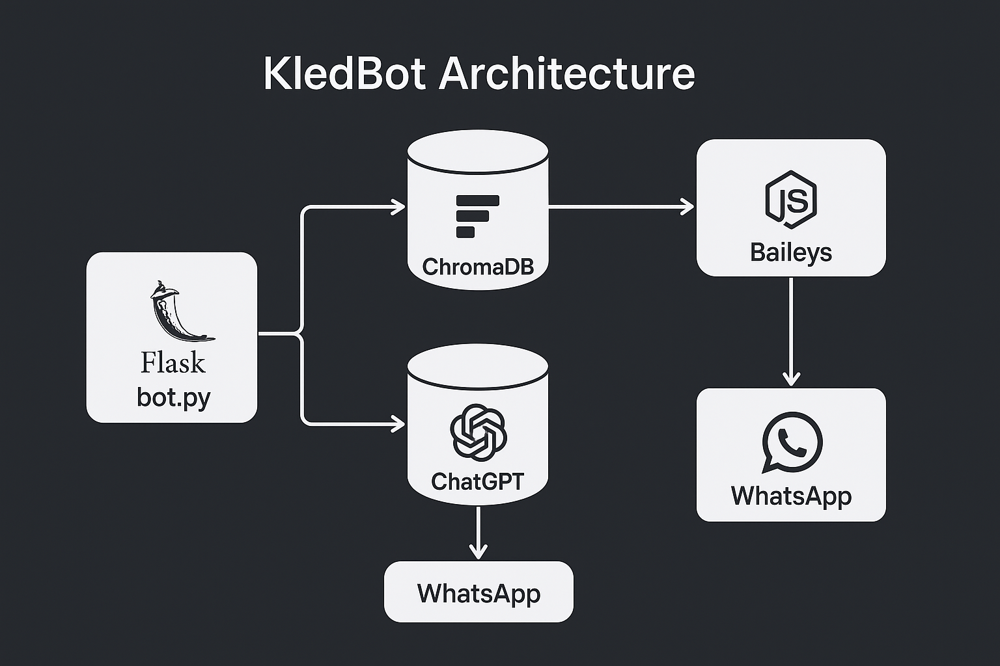

# 🤖 KledBot

**KledBot** es un asistente conversacional para atención a clientes vía WhatsApp, desarrollado para la tienda en línea **Kled**. Este chatbot combina la inteligencia de **OpenAI**, recuperación de contexto mediante **ChromaDB** (arquitectura RAG), y conectividad vía **Baileys**, todo dentro de una arquitectura ligera, modular y escalable.

Su objetivo es automatizar respuestas, sugerir productos desde el catálogo y resolver preguntas frecuentes, mejorando la experiencia del usuario y reduciendo la carga operativa.

---

## 🧱 Requisitos Previos

- Ubuntu Server 22.04+
- Python 3.12+
- Node.js 18+
- `pm2` y `nginx` instalados

---

## ⚙️ Instalación de Dependencias

1. Crear y activar entorno virtual:
```bash
python3 -m venv env
source env/bin/activate
```

2. Instalar dependencias:
```bash
pip install -r requirements.txt
```

3. Instalar dependencias de Node:
```bash
npm install
```

---

## 📁 Estructura del Proyecto

```
kledbot/
├── bot.py                  # Servidor principal Flask
├── catalogo.py             # Carga del catálogo a ChromaDB
├── formulario.py           # Carga del formulario FAQ a ChromaDB
├── config.py               # Configuración general
├── kledbot/                # Código fuente principal
│   ├── chatbot.py
│   ├── whatsapp.py
│   ├── langchain_chain.py
│   ├── utils.py
│   ├── n8n.py
│   └── db/
│       └── chromadb/
│           ├── chroma_setup.py
│           └── chroma_queries.py
├── baileys_auth/           # Estado de sesión de Baileys (WhatsApp)
├── scripts/                # Scripts auxiliares (iniciar/verificar chromadb)
├── tests/                  # Pruebas unitarias
├── logs/                   # Logs del sistema
├── docs/                   # Documentación técnica
└── server.js               # Servidor Node para recibir/enviar mensajes
```

---

## 💾 ChromaDB en modo In-Process

KledBot utiliza ChromaDB de forma **interna**, sin necesidad de un servidor separado. El cliente se inicializa así:

```python
chroma_client = chromadb.PersistentClient(path="./kledbot/db/chromadb_storage")
```

Los datos se persisten automáticamente.

---

## 📄 Cargar Catálogo y FAQ

1. Coloca los siguientes archivos en la raíz del proyecto:
   - `catalogoKled.xlsx`
   - `Formulario_Informacion.txt`

2. Ejecuta los scripts:
```bash
python catalogo.py
python formulario.py
```

---

## 🚀 Ejecutar el Bot con PM2

```bash
pm2 start bot.py --interpreter=python3 --name KledBot
pm2 save
pm2 startup
```

---

## 📬 Integración con WhatsApp

- Utiliza **Baileys** como alternativa a la API oficial de Meta.
- El servidor Node.js (`server.js`) recibe mensajes y los reenvía por HTTP a `Flask`.
- Flask procesa el mensaje, consulta ChromaDB y responde con OpenAI.

**Flujo de mensajes:**
```
WhatsApp → server.js → Flask (bot.py) → ChromaDB + ChatGPT → server.js → WhatsApp
```


---

## 🧠 Arquitectura General

> 

---

## 📌 Notas Finales

- Toda la base de conocimiento permanece mientras no se elimine `chromadb_storage/`.
- No es necesario ejecutar ChromaDB como servidor externo.
- Las colecciones `catalogo` y `faq` deben existir antes de iniciar el bot.

---

## 📄 Licencia

Este proyecto está disponible bajo la licencia MIT. Consulta el archivo `LICENSE` para más detalles.

---
